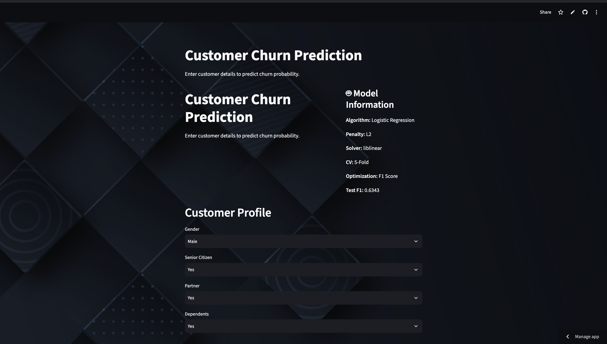

# Customer Churn Prediction

A Machine Learning project that predicts customer churn probability and assigns a **Low, Medium, or High risk level**.

## 🚀 Live Demo

**Streamlit:** https://customer-churn-prediction-by-daksh.streamlit.app
**GitHub:** https://github.com/dakshvirsharma-hub/customer-churn-prediction

## 📊 Dataset

**Telco Customer Churn Dataset**

Features include customer details, services, contract type, payment method, monthly charges, total charges, and tenure.

**Target:** `Churn Value`

## 🤖 Machine Learning

Models tested:

* Logistic Regression
* Random Forest
* KNN
* SVM
* Decision Tree
* Naive Bayes

**Final Model:** Logistic Regression

**Hyperparameter Tuning:** `GridSearchCV` with 5-Fold Cross-Validation

### Performance

| Metric    |      Score |
| --------- | ---------: |
| Accuracy  | **80.90%** |
| Precision | **67.19%** |
| Recall    | **60.06%** |
| F1 Score  | **63.43%** |

## 🧹 Preprocessing

* Label Encoding
* One-Hot Encoding
* StandardScaler
* Feature Selection
* Train/Test Split

## 🔄 Pipeline

```text
Data → Cleaning → EDA → Preprocessing
→ Model Training → GridSearchCV → Evaluation
→ Churn Probability → Risk Level
```

## 🛠️ Tech Stack

**Python · Pandas · NumPy · Scikit-learn · Matplotlib · Seaborn · Streamlit · Joblib · Git**

## 📸 Application




## 👨‍💻 Author

**Dakshvir Sharma**
Data Science & Machine Learning
